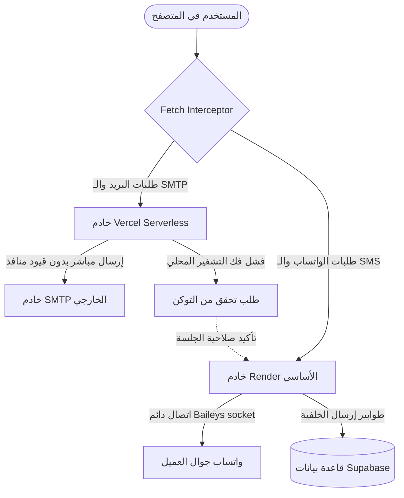

# توثيق حل وعزل مشكلة بروتوكول البريد الإلكتروني (SMTP) في SumerSend

يوثق هذا الملف طبيعة المشكلة التقنية التي واجهت نظام إرسال البريد الإلكتروني (SMTP) والحل الهندسي الذي تم تطبيقه لعزل وتأمين الخدمة بالكامل لتعمل بكفاءة عالية في بيئة الإنتاج المشتركة بين Vercel و Render.

---

## 1. المشكلة التقنية (The Issue)
خادم الخلفية (Backend) الخاص بالمنصة مستضاف على منصة **Render (الخطة المجانية)**. تفرض المنصة قيوداً أمنية صارمة على المنافذ الصادرة للبريد الإلكتروني:
* يتم **حظر المنفذ 25، 465، و 587** بالكامل للحد من إساءة الاستخدام ورسائل السبام (Spam).
* نتيجة لذلك، أي محاولة للاتصال بخوادم SMTP الخارجية (مثل Gmail أو خوادم SMTP مخصصة للمشتركين) من داخل خادم Render تنتهي بالفشل التام أو بمهلة اتصال غير محدودة (`Connection Timeout`).

---

## 2. الآثار المترتبة على النظام
1. **فشل فحص الاتصال بالـ SMTP**: عند قيام المستخدم باختبار الاتصال في الإعدادات، يواجه المتصفح مهلة اتصال طويلة تنتهي بـ `AbortError` أو خطأ `504 Gateway Timeout`.
2. **فشل إرسال رسائل الترحيب**: عند ملء استمارات التضمين (Embed Forms) من المواقع الخارجية، كانت رسائل الترحيب التلقائية تفشل في الوصول للمشتركين.
3. **تفاوت الجلسات (JWT Secrets Mismatch)**: عند محاولة توجيه بعض الطلبات إلى Vercel لحل مشكلة المنافذ، واجه النظام خطأ `Session expired or token invalid` بسبب اختلاف مفتاح تشفير الجلسة السري (`JWT_SECRET`) بين البيئتين.

---

## 3. الحل الهندسي والتنفيذ (The Resolution & Isolation)

تم تطبيق استراتيجية **"العزل الكامل لحركة البريد"** للتأكد من أن جميع العمليات الحساسة للبريد الإلكتروني تُنفذ على منصة **Vercel** (والتي لا تفرض قيوداً على منافذ الـ SMTP الصادرة)، مع إبقاء خادم **Render** مخصصاً للعمليات الدائمة مثل WhatsApp و SMS.

### أ. الفصل الذكي للطلبات في الواجهة الأمامية (Fetch Interceptor)
تم تعديل ملف التشغيل الرئيسي للواجهة [main.tsx](file:///Users/jsmhh/Desktop/rafidain-send/src/main.tsx) ليعترض جميع طلبات الـ HTTP الصادرة:
* إذا كان الطلب يخص الـ SMTP أو البريد الإلكتروني (مثل `/api/smtp/*` أو `/v1/emails` أو `/public/subscribers/join/*`)، يتم توجيهه تلقائياً إلى **نفس دومين الواجهة الحالي (Vercel Same-Origin)** ليعالجه Vercel كـ Serverless Function.
* بقية الطلبات غير المشمولة (مثل الواتساب والـ SMS والتحليلات الدائمة) يتم توجيهها إلى خادم **Render**.

### ب. آلية التحقق المرن من الجلسات (JWT Verification Fallback)
لتجنب تفاوت مفاتيح تشفير الجلسة بين المنصتين، تم تحديث الـ Middleware الأمني في خادم v1 والـ Auth:
* في [auth.js](file:///Users/jsmhh/Desktop/rafidain-send/server/auth.js) و [v1.js](file:///Users/jsmhh/Desktop/rafidain-send/server/routes/v1.js)، عند فشل التحقق من توكن الجلسة محلياً على Vercel، يقوم الخادم فوراً وبشكل تلقائي بطلب التحقق الفوري من خادم Render الأساسي (الذي يمتلك مفتاح التشفير الأصلي).
* في حال تأكيد صحة الرمز، يُكمل Vercel الطلب بنجاح، مما يمنع انقطاع الجلسة أو ظهور خطأ الرموز غير الصالحة.

### ج. تفعيل الإرسال المباشر والسرعة الفائقة
* **الإرسال المباشر (Direct Send)**: تم تعديل الكود ليعمل بنمط `useQueue = false` تلقائياً عند اكتشاف بيئة Vercel (`process.env.VERCEL`). هذا يضمن قيام Vercel بإرسال البريد فوراً للعميل أثناء الطلب بدلاً من تحويله لطابور المهام في Render.
* **تخفيض مهلة الإرسال التناظري**: تم تقليص مهلة الانتظار بين الرسائل أثناء إطلاق الحملات الجماعية في [CampaignsView.tsx](file:///Users/jsmhh/Desktop/rafidain-send/src/components/CampaignsView.tsx) من **1.2 ثانية إلى 100 مللي ثانية فقط**، لتسريع إرسال الحملات إلى أقصى حد ممكن (10 رسائل في الثانية).

### د. تثبيت الإعدادات محلياً (Local Storage Persistence)
* تمت برمجة حقول إعدادات الـ SMTP في [SettingsView.tsx](file:///Users/jsmhh/Desktop/rafidain-send/src/components/SettingsView.tsx) لتقرأ وتكتب تلقائياً في الـ `localStorage` بالمتصفح، لضمان عدم فقدان المستخدم لبيانات الاتصال ومنافذ التشفير عند تحديث الصفحة أو تسجيل الدخول والخروج.

---

## 4. الهيكل التقني لعزل المهام

---
*تم إعداد هذا التوثيق لحفظ البنية الهندسية للمشروع وضمان استمرارية التطوير بسلاسة.*
